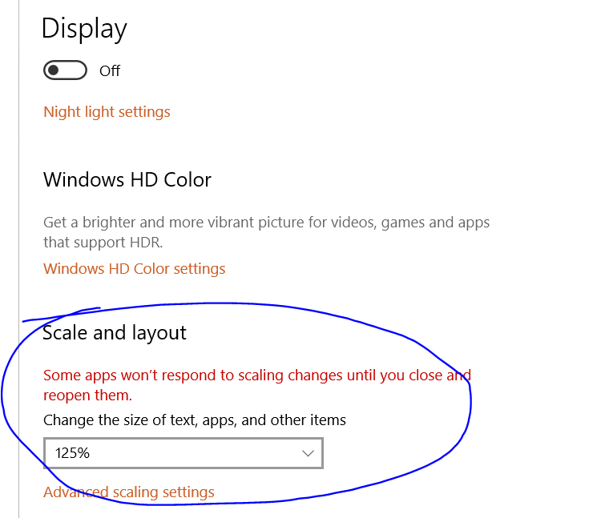
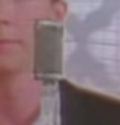

### setup

this issue happens to me when my windows display scaling is set larger than 100%.  In this case 125%

### the needle

### the haystack

### `node index.js`

This demo shows two needle / haystack searches.  Both on 125% scaled windows resolution.

You witness four highlights, documented in the code comments.
 - Scenario 1 - we are going to search the full screen for the needle.  Needle is always found, and correctly returns the expected region.
   - Highlight 1 - full screen highlight showing the search area.
   - Highlight 2 - needle located successfully
 - Scenario 2 - we are going to search only half the pixels in the center of the screen.  Needle is found, but incorrectly returns a weird unexpected / incorrect region (near the actual position).
   - Highlight 3 - highlight of the partial screen to search
   - Highlight 4 - a highlight of the incorrect location after it actually finds the needle.